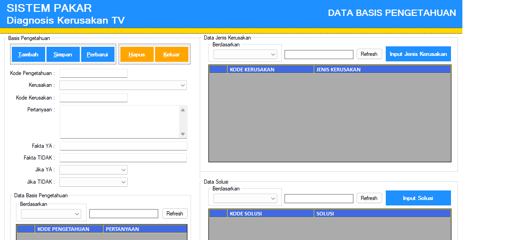

## Sistem Pakar Diagnosis Kerusakan TV

Project ini dibuat untuk memudahkan teknisi pemula ketika mendeteksi kerusakan pada TV yang diservice. Aplikasi ini diterapkan pada toko service WUJUD ELEKTRONIK.
How to Run :
1. Import db_sistempakar.bak pada Sql Server.
2. Jalankan program pada aplikasi Microsoft Visual Studio, kemudian ubah koneksi pada project properties agar dapat terhubung dengan database SQL Server.

Technologies used:

- [VB.Net](https://learn.microsoft.com/en-us/dotnet/visual-basic/)
- [SQL Server](https://learn.microsoft.com/en-us/sql/sql-server/?view=sql-server-ver16)

---

### Made with ❤️ by [Muhamad Jaya][jaya-ig]

---

[jaya-ig]: https://www.instagram.com/muhamadjayaa/
